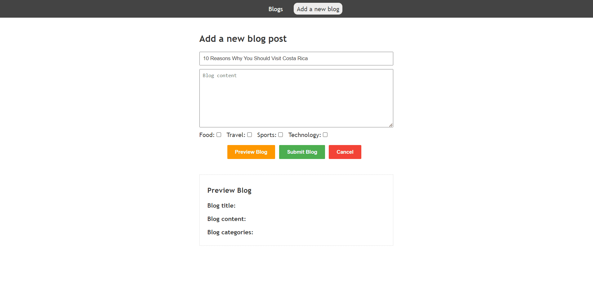
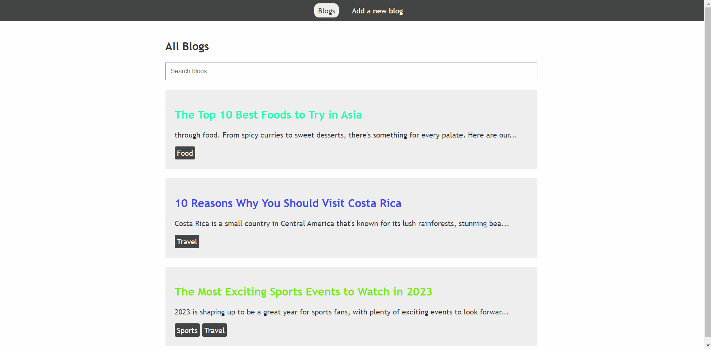

📝 Table of Contents
- [📙 About](#about)
- [🏁 Install](#install)
- [💻 Built using](#tech)
- [📂 Folder Structure](#folderstructure)
- [📷 Demo Screenshots](#screenshots)

# 📙 About <a name = "about"></a>
Blog maker is a simple blog maker app built using Vue js.


# 🏁 Get started <a name = "install"></a>
```
git clone https://github.com/gaserashraf/Blog-Maker.git
```
```
cd Blog-Maker
```
```
npm install
```
```
npm run serve
```

# 💻 Built using <a name = "tech"></a>
- **Vue js**


# 📂 Folder Structure <a name = "folderstructure"></a>
```
|-- src
    |-- App.vue,
    |-- config.json,
    |-- main.js,
    |-- routes.js,
    |-- assets,
    |   |-- logo.png,
    |-- components,
        |-- blog,
        |   |-- addBlog.vue,
        |   |-- blog.vue,
        |   |-- blogCategories.vue,
        |   |-- singleBlog.vue,
        |   |-- viewBlogs.vue,
        |-- navbar,
        |   |-- navbar.vue,
        |-- partials,
            |-- loader.vue,
            |-- notFound.vue
```
# 📷 Demo Screenshots
<div name="screenshots">
    <h3 align='left'>Add blog</h3>
    
    <h3 align='left'>Search for blog</h3>
    
</div>
